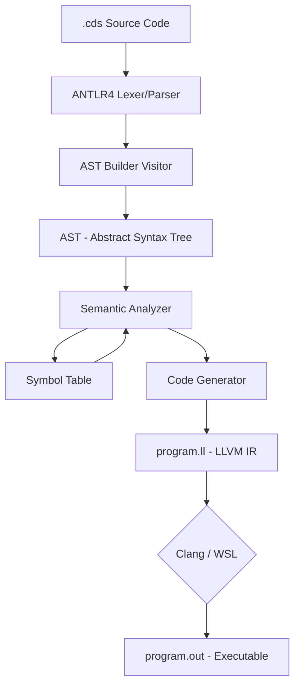

# 🔴 Redlang Compiler (Seli Compiler)

<p align="center">
  
  
  
  
</p>

---

## 🚀 Sobre el Proyecto

**Seli Compiler** es un compilador robusto diseñado para el lenguaje **Redlang** (`.cds`). Implementado en **C#**, este compilador atraviesa todas las fases clásicas (análisis léxico, sintáctico, semántico y generación de código) para transformar código Redlang en un ejecutable nativo utilizando **LLVM** y **Clang**.

Redlang es un lenguaje orientado a objetos con una sintaxis limpia y moderna, ideal para aprender los fundamentos de la construcción de software y compiladores.

---

## ✨ Características Principales

- 📦 **Soporte Multi-archivo:** Organiza tu código en múltiples archivos `.cds` y maneja dependencias con la palabra clave `use`.
- 🏗️ **POO (Orientación a Objetos):** Define clases (`object`) con campos y métodos.
- 🔍 **Análisis Semántico Profundo:** Validación de tipos, verificación de ámbitos, detección de métodos de entrada duplicados y más.
- ⚡ **Backend LLVM:** Generación de código intermedio (LLVM IR) altamente optimizado.
- 🛠️ **Integración con WSL/Clang:** Compilación directa a binarios ejecutables.
- 📥 **I/O Nativo:** Funciones integradas `show` para salida y `ask` para entrada de datos.

---

## 🛠️ Stack Tecnológico

| Componente | Tecnología |
| :--- | :--- |
| **Lenguaje del Compilador** | C# (using .NET) |
| **Generador de Parser** | [ANTLR4](https://www.antlr.org/) |
| **Análisis de Tipos** | Custom Semantic Analyzer |
| **Backend** | LLVM (IR Generation) |
| **Linker/Compilador Nativo** | Clang (vía WSL) |

---

## 📐 Arquitectura del Compilador



---

## 📝 Sintaxis de Redlang

Aquí tienes un ejemplo de cómo luce el código en Redlang:

```redlang
use System;

object Math {
    func factorial(num: i): i {
        check (num == 1) {
            gives num;
        }
        gives num * factorial(num - 1);
    }
}

object Program {
    entry func Main(): i {
        declare m: Math = Math();
        declare result: i = m.factorial(5);
        
        show("El factorial de 5 es:");
        show(result);
        
        gives 0;
    }
}
```

### Palabras Clave:
- `declare`: Declaración de variables.
- `set`: Asignación de valores.
- `check` / `otherwise`: Estructuras de control if/else.
- `loop`: Bucle for.
- `repeat`: Bucle while.
- `gives`: Retorno de funciones.

---

## 🚀 Instalación y Uso

### Prerrequisitos
- **.NET SDK** instalado.
- **WSL** (Windows Subsystem for Linux) con **Clang** instalado para la generación del ejecutable final.

### Pasos
1. Clona el repositorio:
   ```bash
   git clone https://github.com/tu-usuario/redlang-compiler.git
   ```
2. Compila el compilador:
   ```bash
   dotnet build
   ```
3. Ejecuta el compilador pasándole tu archivo de entrada:
   ```bash
   dotnet run -- project/main.cds
   ```
4. El compilador generará un archivo `program.out`. Ejecútalo en WSL:
   ```bash
   wsl ./program.out
   ```

---

## 📂 Estructura del Proyecto

- `/ANTLR4`: Gramática del lenguaje.
- `/Nodes`: Clases del Árbol de Sintaxis Abstracta (AST).
- `/Symbols`: Gestión de la Tabla de Símbolos.
- `SemanticAnalyzer.cs`: El corazón de la lógica de validación de tipos.
- `CodeGenerator.cs`: Generación de LLVM IR.
- `Program.cs`: Punto de entrada del compilador.

---

## 🎨 Iconos Relevantes
🖥️ ⚙️ 🔴 🛠️ 📚 🚀

---

## 🗺️ Roadmap de Próximas Funcionalidades

- [ ] Soporte para arreglos dinámicos.
- [ ] Implementación de herencia entre clases.
- [ ] Optimización de memoria avanzada en LLVM.
- [ ] Editor Web interactivo para probar Redlang.

## 🤝 Contribución

¡Las contribuciones son lo que hacen que la comunidad de código abierto sea un lugar increíble para aprender, inspirar y crear! Cualquier contribución que hagas será **muy apreciada**.

1. Haz un Fork del proyecto.
2. Crea tu Rama de Característica (`git checkout -b feature/AmazingFeature`).
3. Haz un Commit de tus cambios (`git commit -m 'Add some AmazingFeature'`).
4. Haz un Push a la Rama (`git push origin feature/AmazingFeature`).
5. Abre un Pull Request.

---

<p align="center">
  Hecho por <a href="https://github.com/selin-intec">Seli</a> - 2026
</p>

<p align="center">
  Desarrollado con ❤️ para la asignatura de <b>Construcción de Software</b>
</p>
